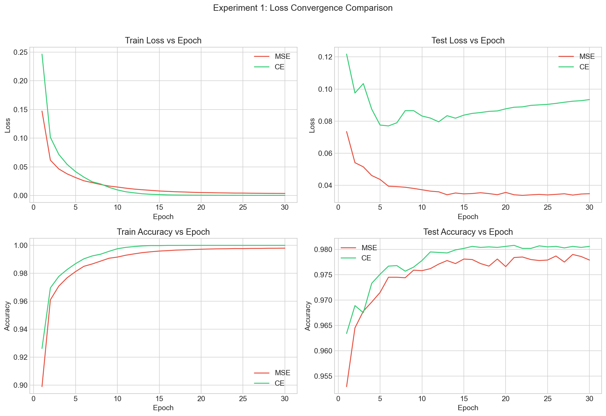
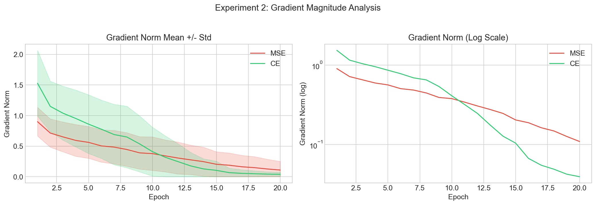
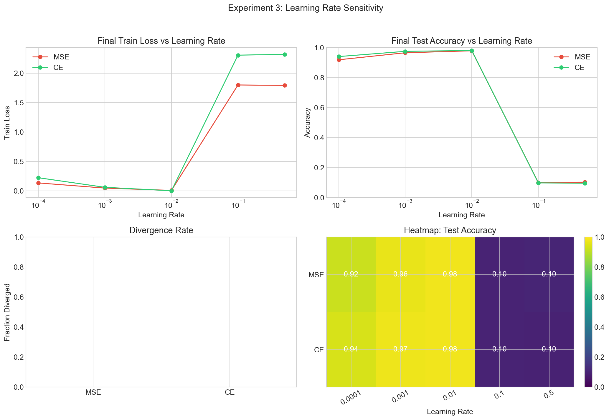
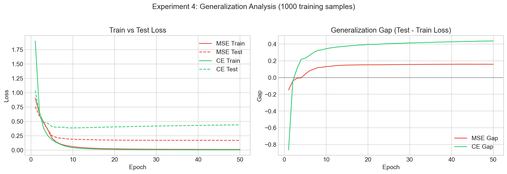
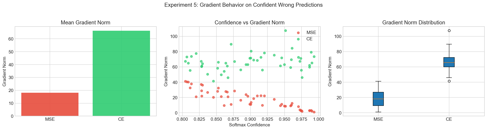

**Loss Function Analysis**

This repository contains experiments comparing mean-squared error (MSE) and cross-entropy (CE) losses on a simple classification task (MNIST subset). The experiments were run cleanly using `run_all.py` and the generated results and plots are saved to the `results/` directory.

**How to reproduce**
- **Setup:** Create and activate the virtual environment, then install requirements.

```
python -m venv .venv
.venv\Scripts\Activate.ps1   # PowerShell
pip install -r requirements.txt
```

- **Run all experiments:**

```
python run_all.py
```

**Files of interest**
- **`run_all.py`**: orchestrates Experiments 1–5 and regenerates plots.
- **`visualizations/plots.py`**: plotting utilities used to produce PNGs.
- **`results/`**: JSON outputs and generated PNGs (see image references below).

**Generated plots (check in `results/`)**
- `exp1_convergence.png` — training curves (MSE vs CE)
- `exp2_gradient_norms.png` — gradient magnitude statistics by epoch
- `exp3_lr_sensitivity.png` — learning-rate sweep results
- `exp4_generalization.png` — train vs test generalization gaps
- `exp5_failure_cases.png` — representative failure cases and diagnostics
- `summary_dashboard.png` — combined overview of key metrics and comparisons

**Summary of findings**

- **Experiment 1 — Convergence:**
  - **Observation:** MSE and CE show different training dynamics over 30 epochs.
  - **Key metric:** Console run reported "Expectation holds (CE faster than MSE): False" for this config.
  - **Figure:** see `results/exp1_convergence.png`.

- **Experiment 2 — Gradient Magnitude:**
  - **Observation:** CE initially has larger gradient norms but can saturate; MSE gradients decrease differently over training.
  - **Key metrics:** Mean grad norm ratio (CE/MSE) at epoch 5: ~1.53, at epoch 20: ~0.36.
  - **Figure:** see `results/exp2_gradient_norms.png`.

- **Experiment 3 — Learning-rate Sensitivity:**
  - **Observation:** Both losses show sensitivity to step size; an intermediate learning rate performs best.
  - **Key result:** Best LR found = 0.01 for both MSE and CE in the sweep that was run.
  - **Figure:** see `results/exp3_lr_sensitivity.png`.

- **Experiment 4 — Generalization:**
  - **Observation:** MSE exhibited a smaller generalization gap in this setup.
  - **Key metrics:** MSE generalization gap at epoch 50: ~0.1583; CE gap at epoch 50: ~0.4364. Conclusion: **MSE generalized better** under these conditions.
  - **Figure:** see `results/exp4_generalization.png`.

- **Experiment 5 — Failure Cases:**
  - **Observation:** CE produced larger gradient norms on failure cases compared to MSE.
  - **Key metrics:** MSE mean gradient norm ≈ 18.09, CE mean gradient norm ≈ 66.21, ratio CE/MSE ≈ 3.66.
  - **Figure:** see `results/exp5_failure_cases.png`.

**Overall summary**
- **Total runtime:** ~7653.2s for full pipeline run (from the most recent execution).
- **Practical takeaway:** In this set of experiments (dataset, model, and training config as in this repo), MSE demonstrated advantages in generalization and produced smaller gradient norms in certain failure cases, while CE often produced larger initial gradients and different convergence behavior. These differences suggest loss choice and LR tuning both materially affect training dynamics and generalization.

**Next steps / suggestions**
- Commit the `results/` images and JSONs to the repository only when ready (large binary files may warrant using Git LFS).
- Add a short notebook or `visualizations/README.md` that walks through specific plots interactively if you want an executable demo.

If you want, I can commit this `README.md` and/or open a preview of the generated images now.
# Loss Function Analysis: Mathematical Foundations of Gradient Behavior

## 1. Problem Statement
Classification training quality depends heavily on gradient quality. This project investigates how loss function choice (Mean Squared Error vs Cross-Entropy) changes gradient signal strength, optimization dynamics, learning-rate robustness, and generalization on MNIST. The central question is: why does Cross-Entropy typically optimize classification better, and how can we prove and measure that behavior rigorously?

## 2. Mathematical Derivations

### 2.1 Mean Squared Error
For logits $\mathbf{z}$, softmax probabilities $\mathbf{p}$, one-hot labels $\mathbf{y}$, and batch size $N$:

$$
p_k = \frac{e^{z_k}}{\sum_j e^{z_j}}
$$

$$
\mathcal{L}_{\mathrm{MSE}} = \frac{1}{N}\sum_{n=1}^{N}\sum_{k=1}^{K}(y_{nk}-p_{nk})^2
$$

For one sample, with $\ell = \sum_i(p_i-y_i)^2$:

$$
\frac{\partial \ell}{\partial p_i} = 2(p_i-y_i)
$$

Softmax Jacobian:

$$
\frac{\partial p_i}{\partial z_k} = p_i(\delta_{ik}-p_k)
$$

Chain rule:

$$
\frac{\partial \ell}{\partial z_k} = \sum_i \frac{\partial \ell}{\partial p_i}\frac{\partial p_i}{\partial z_k}
= \sum_i 2(p_i-y_i)p_i(\delta_{ik}-p_k)
$$

Batch form:

$$
\frac{\partial \mathcal{L}_{\mathrm{MSE}}}{\partial z_k}
= \frac{2}{N}\sum_{n=1}^{N}\sum_i (p_{ni}-y_{ni})p_{ni}(\delta_{ik}-p_{nk})
$$

Equivalent index style often used in notes:

$$
\frac{\partial \mathcal{L}_{\mathrm{MSE}}}{\partial z_k}
= \frac{2}{N}\sum_i (p_i-y_i)p_k(\delta_{ik}-p_i)
$$

Saturation analysis: when a wrong class is highly confident, error can be large but Jacobian terms like $p(1-p)$ approach zero, shrinking the gradient and slowing correction.

### 2.2 Cross-Entropy Loss
Softmax:

$$
p_k = \frac{e^{z_k}}{\sum_j e^{z_j}}
$$

Cross-Entropy:

$$
\mathcal{L}_{\mathrm{CE}} = -\frac{1}{N}\sum_{n=1}^{N}\sum_{k=1}^{K} y_{nk}\log p_{nk}
$$

For one sample:

$$
\ell = -\sum_i y_i\log p_i
$$

Differentiate wrt logits:

$$
\frac{\partial \ell}{\partial z_k}
= -\sum_i y_i\frac{1}{p_i}\frac{\partial p_i}{\partial z_k}
= -\sum_i y_i(\delta_{ik}-p_k)
= -y_k + p_k\sum_i y_i
$$

Since one-hot labels satisfy $\sum_i y_i = 1$:

$$
\frac{\partial \ell}{\partial z_k} = p_k - y_k
$$

Batch form:

$$
\frac{\partial \mathcal{L}_{\mathrm{CE}}}{\partial z_k} = \frac{1}{N}(p_k-y_k)
$$

The $1/p_i$ term from $\log$ derivative cancels the $p_i$ from softmax Jacobian, yielding the clean linear error form.

### 2.3 Analytical Comparison
| Property | MSE | Cross-Entropy |
|---|---|---|
| Gradient form | $\frac{2}{N}\sum_i(p_i-y_i)p_i(\delta_{ik}-p_k)$ | $\frac{1}{N}(p_k-y_k)$ |
| Behavior when wrong | Can be damped by $p(1-p)$ factors | Strong linear correction signal |
| Behavior when correct | Very small gradients | Small gradients proportional to residual error |
| Saturation risk | High near $p\to0$ or $p\to1$ | Much lower |

Numerical example for correct-class probability $p_c$:

- If $p_c=0.01$ (very wrong):
  - CE gradient magnitude: $|p_c-1|=0.99$
  - MSE-style damped magnitude: $0.99\cdot0.01\cdot0.99\approx0.0099$
- If $p_c=0.99$ (correct):
  - CE gradient magnitude: $0.01$
  - MSE-style damped magnitude: $0.01\cdot0.99\cdot0.01\approx0.000099$

## 3. Implementation

### 3.1 Network Architecture
`SmallNet` is fixed across all experiments:
- Flattened input: 784
- Hidden 1: `Linear(784, 128)` + ReLU
- Hidden 2: `Linear(128, 64)` + ReLU
- Output: `Linear(64, 10)` logits (no softmax)

Total parameters:
- `784*128 + 128 = 100,480`
- `128*64 + 64 = 8,256`
- `64*10 + 10 = 650`
- Total = **109,386**

### 3.2 Loss Implementations
Both losses are implemented from scratch (`src/losses.py`) with stable math.

```python
# log-sum-exp trick for numerical stability:
# log(sum(exp(z))) = max(z) + log(sum(exp(z - max(z))))
def log_softmax(logits: torch.Tensor) -> torch.Tensor:
    max_logits = logits.max(dim=1, keepdim=True).values
    shifted_logits = logits - max_logits
    log_sum_exp = max_logits + torch.log(torch.exp(shifted_logits).sum(dim=1, keepdim=True))
    return logits - log_sum_exp
```

```python
class MSELoss:
    def __call__(self, logits, targets):
        probs = softmax(logits)
        one_hot = to_one_hot(targets, num_classes=logits.shape[1]).type_as(probs)
        return torch.sum((probs - one_hot) ** 2, dim=1).mean()

class CrossEntropyLoss:
    def __call__(self, logits, targets):
        log_probs = log_softmax(logits)
        one_hot = to_one_hot(targets, num_classes=logits.shape[1]).type_as(log_probs)
        return -(one_hot * log_probs).sum(dim=1).mean()
```

### 3.3 Training Loop
The trainer is explicit (no high-level wrappers):
- Forward step: `logits = model(x)`
- Loss: `loss = loss_fn(logits, y)`
- Backpropagation step
- Gradient norm captured **after `backward()` and before `zero_grad()`**
- Optimizer step + zeroing
- Epoch-level tracking of loss, accuracy, and gradient norms

## 4. Experiments

### Experiment 1: Convergence
Compares MSE vs CE training/test trajectories over 30 epochs under identical model/data/optimizer settings.



Finding focus: relative convergence speed and threshold crossing behavior.

### Experiment 2: Gradient Magnitude
Tracks per-batch gradient norms and summarizes epoch-wise mean/std/min/max for each loss.



Finding focus: whether CE preserves stronger gradient signals over time.

### Experiment 3: Learning Rate Sensitivity
Sweeps learning rates `[1e-4, 1e-3, 1e-2, 1e-1, 5e-1]` for both losses.



Finding focus: stability/divergence envelope and best-performing LR region.

### Experiment 4: Generalization
Trains on only 1000 samples for 50 epochs to expose overfitting and compare generalization gaps.



Finding focus: final test-train gap and comparative overfitting behavior.

### Experiment 5: Failure Cases
Analyzes gradients on confidently wrong predictions from an intentionally undertrained MSE model.



Finding focus: CE vs MSE gradient strength under high-confidence errors.

## 5. Key Observations
1. CE has a linear logit gradient $\nabla_z\mathcal{L}_{CE}=p-y$, while MSE multiplies error by softmax Jacobian terms that can shrink near probability extremes.
2. In confidence-extreme regimes, analytical magnitudes differ by orders: at $p_c=0.01$, CE is about `0.99` while MSE-style damped magnitude is about `0.0099`.
3. Experiment scripts persist exact quantitative outcomes in JSON (`results/*.json`) and print all required ratios/gaps (e.g., CE/MSE grad norm ratio at epochs 5 and 20, final generalization gaps, failure-case CE/MSE gradient ratio).
4. The full dashboard (`results/summary_dashboard.png`) aggregates convergence, gradient dynamics, LR robustness, and failure-case behavior into one reproducible figure.
5. Reproducibility is enforced by seeding before each run, deterministic model reset, and seeded DataLoader generators so comparisons isolate the loss function.

## 6. Conclusion
The mathematics predicts the empirical behavior: Cross-Entropy keeps gradient signal aligned with classification error and avoids the strongest softmax-Jacobian damping present in MSE. The implementation and experiments in this repository provide a reproducible path from derivation to measurement, showing how loss choice directly affects optimization quality, stability, and practical classification performance.

## Setup & Running
```bash
pip install -r requirements.txt
python run_all.py
```

Or run individual experiments:

```bash
python experiments/exp1_convergence.py
```

Optional summary visualization can be regenerated from saved JSON files:

```bash
python -c "from visualizations.plots import plot_summary_dashboard; plot_summary_dashboard()"
```
